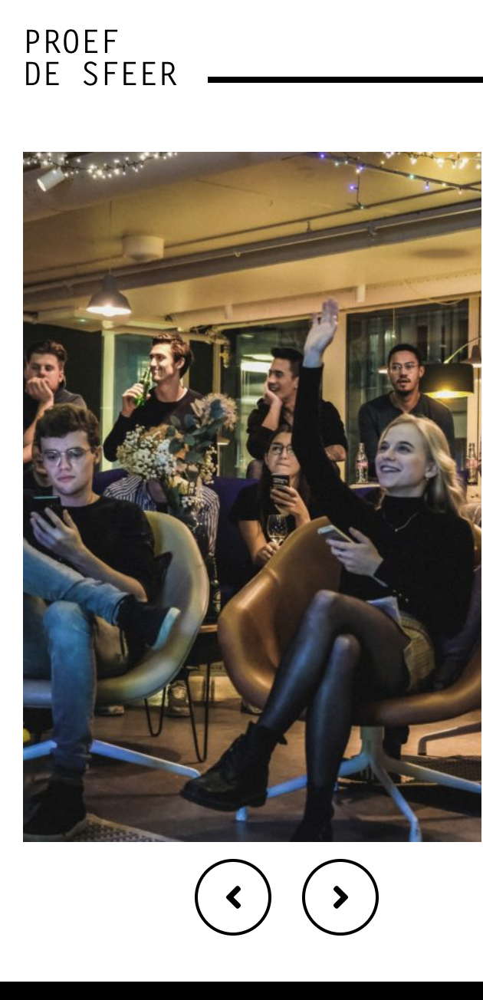
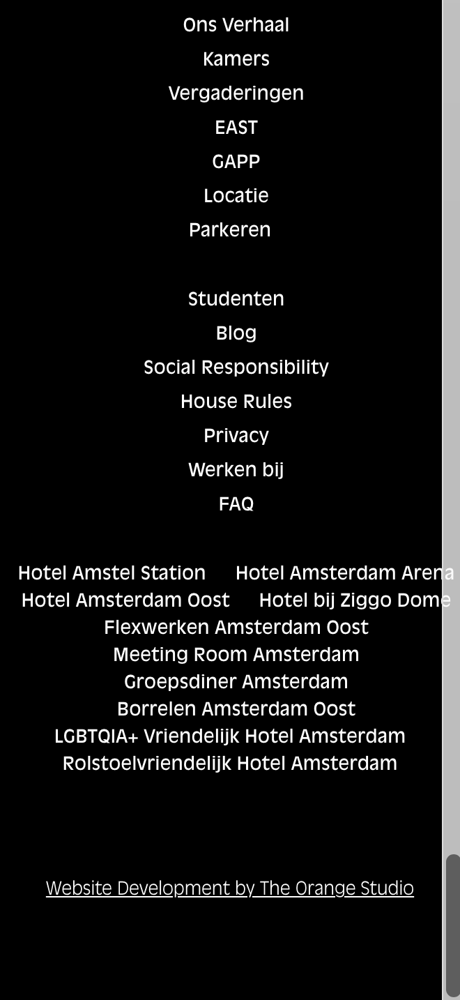
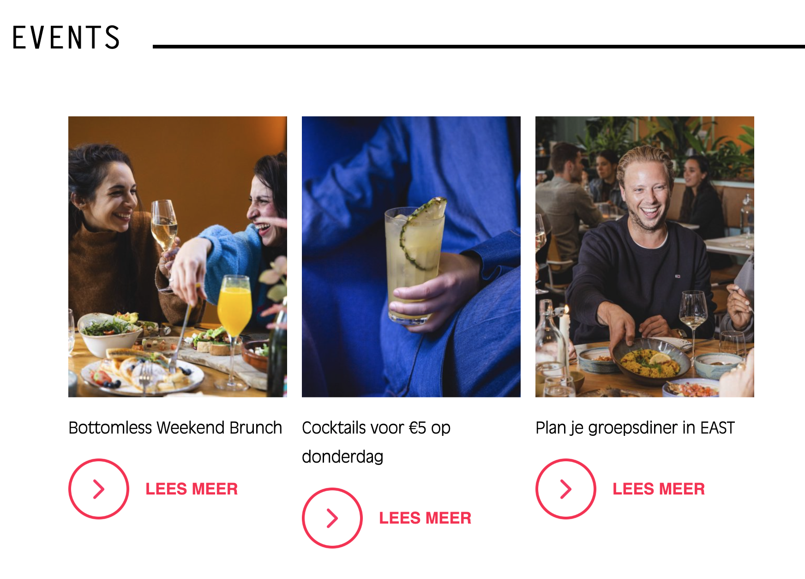

# Procesverslag
Markdown is een simpele manier om HTML te schrijven.  
Markdown cheat cheet: [Hulp bij het schrijven van Markdown](https://github.com/adam-p/markdown-here/wiki/Markdown-Cheatsheet).

Nb. De standaardstructuur en de spartaanse opmaak van de README.md zijn helemaal prima. Het gaat om de inhoud van je procesverslag. Besteedt de tijd voor pracht en praal aan je website.

Nb. Door *open* toe te voegen aan een *details* element kun je deze standaard open zetten. Fijn om dat steeds voor de relevante stuk(ken) te doen.

## Jij

  
uitwerken voor kick-off werkgroep

  ### Auteur:
  Amy Muller

  #### Je startniveau:
 Blauw (beginner)

  #### Je focus:
  Surface Plane
 

## Je website

  
uitwerken voor kick-off werkgroep

  ### Je opdracht:
  https://hotelcasa.nl/nl/studenten/

  #### Screenshot(s) van de eerste pagina (small screen): 
  hier de naam van de pagina  
  
   
   
    
 
  
   
 
 
  #### Screenshot(s) van de tweede pagina (small screen):
  https://hotelcasa.nl/nl/east/?p=base&c=search 
  
 
  
   
    
     

## Toegankelijkheidstest 1/2 (week 1)

  
uitwerken na test in 2e werkgroep

  ### Bevindingen
  Lijst met je bevindingen die in de test naar voren kwamen:
- De heading staan allemaal door elkaar, waardoor er tijdens het lezen met de screenreader er geen logische volgorde in zit. 
- Ze gebruiken divs op plekken waar ul/li nodig zijn, zoals bij de reviews. Ze doen het wel goed bij het menu. 
- Niet alle afbeeldingen hebben een alt-tekst. De afbeeldingen die gewrapped zijn, zoals de eerste bij de introductie, bevatten geen alt tekst. 
- Bevatten nergens skip-links
- Alle links zijn wel herkenbaar en juist geplaats (dus geen buttons)
- Light & Dark mode is NIET supported, contrast-mode ook niet. 
- Geen prefers-reduced-motion media query.
- Kleur is niet de enige communicatie middel

-Niet helemaal goed responsive, de heading lopen tot buiten het scherm
-Bij een klein scherm worden de reviews overlapt door een andere sectie. 
-Bij het kleiner worden van het scherm, worden de fotos die naast elkaar in een wrap zitten zo klein dat het niet meer zichtbaar word

## Breakdownschets (week 1)

  
uitwerken na afloop 3e werkgroep

  ### de hele pagina: 
  

  ### dynamisch deel (bijv menu): 
  

  <!-- ### wellicht nog een dynamisch deel (bijv filter): 
   -->

## Voortgang 1 (week 2)

  
uitwerken voor 1e voortgang

  ### Stand van zaken
  Ik heb de eerste pagina al een beetje in elkaar gezet om warm te worden en weer even het coderen terug te halen, alleen dit was eigenlijk zonde van mijn tijd... Ik heb hier overal classes gebruikt en begon op laptop formaat. Ik ga nu dus opnieuw beginnen, maar heb wel een fris beeld van hoe ik het dan ga moeten aanpakken. Ik vind het werken met weinig sections wel heel moeilijk en ik moet zeker wennen aan de pseudo selectoren. 

  ### Agenda voor meeting
  samen met je groepje opstellen

Vragen:
- Moet ik mijn H2 en H3 omdraaien ? Ik heb het nu namelijk zo: 
<section>
<h2>Kamers</h2>
<h3>Wonen in Casa</h3>

- Gebruik ik mijn aria-labels nu goed?
- Github lukt mij nog niet, hoe pak ik dit aan?

  ### Verslag van meeting
  hier na afloop snel de uitkomsten van de meeting vastleggen

  - De h2 en H3 moet je inderdaad omdraaien (en dan kan ik dus met flex order aanpassen wat waar staat, cruciaal voor de screenreader)
  - Nee, teveel onnodige aria labels, is alleen nodig op plekken waar het niet duidelijk is wat het precies inhoud. 
  - Github is opgelost.  

## Voortgang 2 (week 3)

  
uitwerken voor 2e voortgang

  ### Stand van zaken
  hier dit ging goed & dit was lastig (neem ook screenshots op van delen van je website en code)

  ### Agenda voor meeting
  samen met je groepje opstellen

Vraag Xavanna en ik:
Hoe moeten we een dropdown maken?

- Ik heb nu heel veel sections, zonder heading... mag dit? Bijv --> <section>
          <a href="x" aria-label="Meer informatie over de kamers van Casa">
            <section>
              
            </section>
            
Check onze kamers

          </a>
        </section>

  ### Verslag van meeting
  hier na afloop snel de uitkomsten van de meeting vastleggen

  - Dropdown samen gedaan met Sanne, notities gemaakt nu thuis zelf ermee aan de slag. 

  - Deze sections zijn eigenlijk divs, als er geen tekst in een section staan, maar alleen andere elementen, dan mag je als er geen andere mogelijkheid is een div gebruiken. Dus dat even aanpassen. 

  - Mijn javascript bestand zat niet goed gekoppeld, waardoor niks van mijn javascript het deed. 

- CSS moet netter, nu staat alles door elkaar. 

- Ik kan een random youtube video gebruiken waarbij de rechten wel verleend kunnen worden. (de originele van casa doet het niet)

- H2 en H3 staan nog steeds verkeerd om. 

## Toegankelijkheidstest 2/2 (week 4)

  
uitwerken na test in 9e werkgroep

  ### Bevindingen
  - Ik heb nog geen focus elementen toegevoegd, dus op mijn menuknop bijv is er geen duidelijke focus. Ook heb ik een quick link gemaakt voor bv de keyboard navigatie, zodat die gelijk doorkunnen naar "boeken" of "inschrijven"
  <!-- <li><a href="main>section:nth-of-type(2)">Lees meer over de inschrijfprocedure</a> -->
  en 
  <!-- <li><a href="main>section:nth-of-type(4)">Boek gelijk een tafel</a> -->

  - Ik ben nog steeds bezig met mijn code netjes en overzichtelijk maken. Ik maak nu gebruik van zulke dingen: * ////////////////////////////////////////
          SLIDER EAST PAGINA
/////////////////////////////////////// */
Dit helpt erg om voor mij duidelijke categorieen te maken. 
- Ik moet nog steeds veel doen aan accesibility, de light dark modus bv en wanneer ik aan animaties begin moet ik ook niet de reduce motion functionaliteit vergeten. 

## Voortgang 3 (week 4)

  
uitwerken voor 3e voortgang

  ### Stand van zaken
- Ik heb inmiddels al een paar animaties kunnen toevoegen met keyframes. De dropdown werkt eindelijk, maar ik krijg de dropdown niet op de juiste manier gestyld. 
- De reduce motion functie werkt en de light/dark knop ook op de juiste manier. 
- Er moet nog veel gebeuren aan de 2e pagina. Ik ben nu begonnen met de FAQ, om de labels werkend te krijgen op de juiste manier, zodat ook de svg van kleur aanpast bij light/dark mode. 

  ### Agenda voor meeting
  samen met je groepje opstellen

  - Waarom krijg ik mn dropdown lettertype enkel erin niet gestijlt???

    - De list-items, kan ik die misschien beter in een grid stoppen? Voor resposivenes

    -Waarom worden mijn svg steeds kleiner en groter.   

  ### Verslag van meeting
  hier na afloop snel de uitkomsten van de meeting vastleggen
- Ik had het pseudo-element te specifiek gemaakt. Door steeds > te gebruiken, terwijl het geen direct kind was. 

-Ik moet de list inderdaad in een grid gaan zetten. Dit is ook handig voor Maya en Wick sectie. 

-Er zit inline css in de svg tags, Ik moet een span toevoegen waarin de svg staat. En dan ook mn code aanpassen details > summary > span svg {
  transform: rotate(0deg);
  transition-duration: 1s;
  width: 1em; 
  margin-left: 1em;
  transition: .5s;
  display: block;
}
 
details > summary > span {
  margin-left: 10px;
  display: inline-block;
  width: 1em;
  height: 1em;
}

## Eindgesprek (week 5)

  
uitwerken voor eindgesprek

  ### Je uitkomst - karakteristiek screenshots:
  

  ### Dit ging goed/Heb ik geleerd: 
- Hoe je @keyframes goed kan gebruiken om mooie effecten te creeren. Ik weet nu hoe ik de verschillende translate/rotates etc kan gebruiken en dit tegelijkertijd kan combineren met kleurveranderingen of bijvoorbeeld scales.  

-Hoe ik grid kan gebruiken, eerst deed ik er altijd alles aan om grid te vermijden omdat ik het niet begreep. Inmiddels zie ik in hoe ontzettend handig het kan zijn. Zo heeft het mij geholpen mijn reviews responsive te maken op de juiste manier (ipv de echte site van casa, waar reviews worden bedekt door andere secties)

-Het mobile first principe, ik had eerst de hele website geprogrammeerd op laptop formaat. Maar het responsive maken hiervan was zo moeilijk en omslachtig, dat ik uiteindelijk maar gewoon opnieuw ben begonnen. Hier ben ik veel tijd in verloren, maar ik kon simpelweg door de bomen het bos niet meer zien. Vanuit het mobile first te programmeren was in ieder geval een stuk makkelijker!
  

  ### Dit was lastig/Is niet gelukt:
 -Het maken van een dropdown, vond ik ontzettend moeilijk maar wel heel uitdagend. Vooral omdat het aanroepen met pseudo-selectoren volledig nieuw voor mij was, hierdoor was het vaak puzzelen met background-color:#blue; om te achterhalen welk element ik nou precies selecteerde. 

 -De light dark mode op zowel de knop als de laptop zelf te laten aanpassen. Want het tegenstrijdde elkaar steeds waardoor 1/2 niet werkte. Toen had Kim aangegeven alleen de knop te doen, omdat dat beter zou zijn voor de surface plane. 

 -De @media query om de prefers-contrest:high te laten werken. Dit wordt nog niet ondersteunt door google. Ik zou het natuurlijk net als de light/dark modus met een button kunnen oplossen, die dan op .active een andere kleurpallet aanhoud. Maar ik heb daar helaas geen tijd meer voor. 
 
 @media (prefers-contrast: high) {
  :root {
    --header-bg: black;
    --main-color: yellow;
    --fontlightbackground-color: white;
    --fontdarkbackground-color: black;
    --background-footer: black;
    --whitefont-footer: white;
    --background-body: black;
  }

  

  
uitwerken voor eindgesprek

### Gekregen feedback tijdens gesprek: 
--Alle sections moeten WEG

--Alles moet netter geschreven worden, zonder onnodige notities, zonder dubbele styling in meerder documenten. Documenten kunnen ook samengevoegd worden zodat het overzichtelijker blijft. 

-- Haal de onnodige on-scroll animatie weg. 

-- Voeg de high contrast mode toe

-- Niet zo grof de prefers motion mode doen op alles, maar per animatie instellen

-- Zet je styling op volgorde van het document en niet zo zeer op element soort. 

--Je komt nog 0.5 punt voor de surface plane te kort, dus ik zou de video erin programmeren. 

-- De vinkjes binnen de checkboxen zijn niet goed gepositioneerd op een responsive manier. 

### Vragen voor meeting donderdag 16 januari: 
-- VRAAG: Mag ik wel DIVS gebruiken op de plek van section 3 op mijn east.html (events) pagina. om op de juiste manier de grid te kunnen toepassen, zonder dat dit impact heeft op de h3, zoals ik nu heb gedaan. ————> MAAK ER EEN LIST VAN. 

-- VRAAG: Gebruik ik bij east.html, op de section van de carousel divs of sectie? Want een sectie moet normaal een h2 of een andere heading hebben maar dat heeft ie niet. ———> Maak hier ook een list van en H2 toevoegen (is al toegevoegd)

--- VRAAG: Hoe zorg ik bij east html ervoor dat events buiten de sectie valt. Zodat deze niet groter en kleiner word. Zonder het gebruik te maken van een extra div.. ———>MAAK ER EEN LIST VAN. 

### Wat heb ik aangepast: 
--Ik heb eerst het document (van onnodige) sectie's en divs proberen te verwijderen, maar ik kon door de bomen het bos niet meer zien. En heb uiteindelijk besloten om alles regel per regel te kopieren en om te schrijven naar een ander document. Hierdoor heb ik geleerd dat op veel plekken waar ik "divs" of "secties" gebruik ik bijvoorbeeld ul had moeten gebruiken, waardoor ik daarop weer styling kon doen. In mijn hoofd zijn lijsten heel zwart/wit "boter, broccoli, kaas" of "1,2,3" maar het kunnen natuurlijk grotere blokken zijn. Met in elke li weer meerdere elementen/onderdelen. 

-- Ik heb een high-contrast mode toegevoegd op de juiste manier en ook de reduce motion toegevoegd per animatie, i.p.v één overkoepelende mediaquery. 

-Ik heb mijn hele styling dus ook opnieuw kunnen/moeten maken waardoor ik een duidelijkere volgorde heb gemaakt. Ik merkte dat dit vooral voor mijzelf veel makkelijker werken was, omdat ik nu niet bij verschillende "element-categorieën" aan het zoeken was om iets aan te passen. 

-- Ik heb de video geprogrammerd met verschillende buttons. Ik had al eerder "input type" gebruikt voor bv de submit knop in de footer, hierbij had ik ook al de input type range voorbij zien komen, deze wilde ik dus gelijk toevoegen aan mijn video, maar de uitdaging zat hier wel echt in het programmeren. 

-- Ik heb Abbr toegevoegd en ik heb de sociale media kanalen elk doorgelinkt. 

-- Ik heb de WCAG checklist afgerond en beter accesible gemaakt, ik scoorde bijvoorbeeld te laag op contrast bij mijn reviews op index.html, daar heb ik nu dus de kleuren van aangepast. 

-- Ik heb de positite van de vinkjes binnen de checkboxen aangepast, en ik heb ul en li toegevoegd binnen de footer. 

-- Ik heb overal alles probberen op te schonen en netter te maken. Puntjes op de i gezet, waar ik vorige keer geen tijd voor heb gehad. Ook ben ik er nog een keer met de voiceover doorheen gegaan voor focus points. 

## Bronnenlijst

  
continu bijhouden terwijl je werkt

  Nb. Wees specifiek ('css-tricks' als bron is bijv. niet specifiek genoeg). 
  Nb. ChatGpT en andere AI horen er ook bij.
  Nb. Vermeld de bronnen ook in je code.

  1. SLIDER INDEX PAGINA - regel 27-59 van javascript gemaakt met de volgende bron: https://www.youtube.com/watch?v=uAAD3mmQGRQ 

  2. ANIMATION ON SCROLL - bron lesstof https://www.youtube.com/watch?v=T33NN_pPeNI 

3. Automatic slideshow east.html
https://www.w3schools.com/howto/howto_js_slideshow.asp

Class list begrijpen
https://developer.mozilla.org/en-US/docs/Web/API/Element/classList.com

transform toevoegen aan javascript 
https://www.w3schools.com/jsref/prop_style_transform.asp

//  ChatGPT4o - toen mijn eerste versie code niet goed werkte van de automatische slider.  

4. Embedding video 
https://www.w3schools.com/Html/tryit.asp?filename=tryhtml5_video_js_prop

https://forum.bubble.io/t/javascript-for-muting-html5-video/335035

https://stackoverflow.com/questions/67343937/control-audio-with-a-slider 

